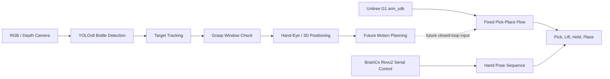

# Vision-Guided Manipulation System for Unitree G1

面向宇树 G1 人形机器人的视觉辅助抓取系统。项目把 G1 左臂、强脑 Revo2 左灵巧手、RGB/深度相机和 YOLOv8 水瓶检测接到同一套工程流程中，目标是完成“看见水瓶、判断位置、抓取、抬起展示、放回、收手”，并继续推进到手眼标定和自动化路径规划。

当前仓库保留了实体机器人调试中已经跑通的核心脚本、视觉检测模块、抓取窗口判断、深度和坐标转换实验、手部控制脚本、测试脚本和恢复文档，适合继续开发，也适合对外展示项目进展。

## 项目亮点

| 亮点 | 说明 |
| --- | --- |
| 实体 G1 验证 | 主流程面向真实 Unitree G1 和 Revo2 灵巧手调试 |
| 手臂和灵巧手联动 | G1 左臂固定轨迹与 Revo2 左手抓瓶手型已经整合到独立主流程 |
| 独立全流程脚本 | `arm_pick_place_standalone.py` 内置机械臂轨迹、手部串口连接、手型参数和安全释放 |
| 视觉检测可运行 | YOLOv8 RGB 水瓶检测脚本可实时输出目标框、中心点和置信度 |
| 目标跟踪更稳定 | 检测脚本加入平滑追踪、跳变限制和目标锁定，减少识别框在相邻物体之间跳动 |
| 安全流程明确 | 脚本包含初始位检查、异常偏差停止、空手测试入口和平滑释放 `arm_sdk` |
| 继续开发资料完整 | 仓库保留恢复步骤、模型清单、排除文件清单和测试入口，便于换环境后继续做 |

## 当前能力状态

| 模块 | 状态 | 代表文件 |
| --- | --- | --- |
| 固定轨迹抓瓶 | 已跑通主流程 | `g1_hand_arm_project/arm_pick_place_standalone.py` |
| Revo2 左手控制 | 已接入主流程，可单独测试 | `hand_control/revo2/left_hand_safe_once.py` |
| RGB 水瓶检测 | 已可实时运行 | `g1_hand_arm_project/vision/detect_bottle_2d.py` |
| YOLO 检测启动脚本 | 已整理常用参数 | `g1_hand_arm_project/vision/start_bottle_rgb_fast.sh` |
| 目标跟踪 | 已加入检测脚本 | `TargetTracker` in `detect_bottle_2d.py` |
| 深度检测 | 已保留实验脚本 | `g1_hand_arm_project/vision/detect_bottle_depth.py` |
| 目标点记录 | 已记录固定点和随机点 | `g1_hand_arm_project/vision/records/` |
| 抓取窗口判断 | 已有任务级判断脚本 | `compare_bottle_to_target.py`, `auto_grasp_decision.py` |
| 相机到机器人坐标实验 | 已有初步转换脚本 | `transform_bottle_to_base.py` |
| 路径规划闭环 | 正在推进 | 手眼标定和轨迹规划完成后接入 |

## 演示效果

当前推荐展示的是“视觉辅助 + 固定轨迹抓放”流程：

1. RGB 相机打开，YOLOv8 检测水瓶。
2. 检测脚本在画面中标出水瓶框，输出 `cx`, `cy`, `confidence`。
3. 用户确认水瓶在固定抓取区域内。
4. G1 左臂执行预抓轨迹，到达水瓶附近。
5. Revo2 左手执行预备手型，再完成抓握。
6. G1 小臂抬起水瓶并悬停展示。
7. 大臂外扩，避开身体和桌面边缘。
8. 小臂下放，灵巧手张开，把水瓶放回原位。
9. 空手收回，脚本平滑释放手臂控制权。

这个流程已经覆盖机器人抓取任务中最关键的几个环节：视觉检测、机械臂运动、灵巧手抓握、物体抬起、放回和安全收尾。

## 系统架构



当前系统采用分层推进方式：底层先保证实体机器人动作安全可靠，中层接入视觉检测和目标判断，上层再接手眼标定和规划闭环。

## 核心流程

### 机械臂与灵巧手

主脚本：

```text
g1_hand_arm_project/arm_pick_place_standalone.py
```

脚本能力：

- 读取 G1 `lowstate`，以当前姿态构造相对轨迹。
- 检查手臂是否接近安全初始位。
- 偏差过大时停止，不强行动作。
- 不接近初始位时缓慢收回到安全姿态。
- 直接连接 Revo2 左手串口，不再通过 `subprocess` 调用手部脚本。
- 到达固定点后执行 `thumb_open_max -> thumb_ready -> bottle` 手型序列。
- 抓住后抬小臂，悬停 3 秒。
- 抬瓶后大臂外扩，再下放小臂并张手释放。
- 空手收回后保持当前关节，再平滑降低 `WEIGHT=29` 释放 `arm_sdk`。

常用命令：

```bash
python3 arm_pick_place_standalone.py
python3 arm_pick_place_standalone.py eth0
python3 arm_pick_place_standalone.py --hand-only-test
```

`--hand-only-test` 只测试 Revo2 手部动作，不初始化机械臂，适合在实体动作前确认手型。

### 视觉检测与目标跟踪

主检测脚本：

```text
g1_hand_arm_project/vision/detect_bottle_2d.py
```

推荐启动脚本：

```text
g1_hand_arm_project/vision/start_bottle_rgb_fast.sh
```

当前默认参数：

```text
RGB source: /dev/video4
backend: V4L2
resolution: 640x480
YOLO imgsz: 640
confidence: 0.15
infer-every: 2
track-max-jump: 80
track-smooth-alpha: 0.35
track-lost-frames: 12
track-switch-frames: 8
track-lock-conf: 0.25
```

检测脚本输出：

```text
cx=<target center x>, cy=<target center y>, conf=<confidence>
```

目标跟踪逻辑会优先延续上一帧锁定目标。新目标需要达到置信度阈值，并持续出现后，脚本才会切换目标。这个策略比每帧只取最高置信度更适合桌面抓取场景。

## 仓库结构

```text
.
├── g1_hand_arm_project/
│   ├── arm_pick_place_standalone.py
│   ├── test_arm_pick_place_flow.py
│   ├── tools/
│   └── vision/
│       ├── detect_bottle_2d.py
│       ├── start_bottle_rgb_fast.sh
│       ├── detect_bottle_depth.py
│       ├── record_bottle_positions.py
│       ├── compare_bottle_to_target.py
│       ├── auto_grasp_decision.py
│       ├── transform_bottle_to_base.py
│       └── records/
├── hand_control/
│   └── revo2/
│       └── left_hand_safe_once.py
├── models/
│   └── MODEL_MANIFEST.md
├── docs/
│   ├── PROJECT_SHOWCASE.md
│   ├── RESTORE_AFTER_FACTORY_RESET.md
│   ├── EXCLUDED_FILES_MANIFEST.md
│   └── USER_PROJECT_OVERVIEW.md
└── legacy/
    └── revo2_arm_hand_experiments/
```

公开仓库只保留适合展示和继续开发的内容。厂商 SDK、大型训练数据集、大模型、本地运行配置、个人密钥和本地 GUI 终端目录不进入公开仓库。

## 快速入口

### 查看项目能力

```text
README.md
docs/PROJECT_SHOWCASE.md
docs/USER_PROJECT_OVERVIEW.md
```

### 恢复机器人环境

```text
docs/RESTORE_AFTER_FACTORY_RESET.md
docs/EXCLUDED_FILES_MANIFEST.md
models/MODEL_MANIFEST.md
```

### 运行静态检查

在机器人项目目录中：

```bash
python3 -m py_compile arm_pick_place_standalone.py
python3 -m unittest test_arm_pick_place_flow.py
python3 -m unittest tools/test_arm_pregrasp_preview.py
```

视觉脚本测试：

```bash
cd g1_hand_arm_project/vision
python3 -m unittest test_detect_bottle_2d.py
```

## 工程设计取舍

### 先固定轨迹，再做视觉闭环

实体人形机器人比仿真环境更容易受到桌面高度、线缆、姿态误差和相机延迟影响。当前主流程先用固定轨迹保证抓放动作稳定，再用视觉判断瓶子是否落在可抓区域内。这样可以把机械臂安全和视觉算法分开验证。

### 手臂和手部控制分离

项目把 G1 `arm_sdk` 控制和 Revo2 手部串口控制分层管理。单独手部测试脚本只控制手指，主流程脚本才协调手臂和手。这种边界能降低误动作风险，也便于单独调手型。

### 安全释放优先

主流程不使用空 `LowCmd` 直接释放手臂控制权。脚本结束时保持当前关节状态，再平滑降低权重。这个处理来自实体机器人调试经验，能减少手臂突然失控和电机异常声音的风险。

### 视觉追踪面向真实桌面

桌面场景中，水瓶附近可能有手、机械臂、反光区域或其他物体。检测脚本加入目标锁定和平滑策略，让识别框跟随当前目标，减少逐帧切换到高置信度干扰区域的情况。

## 路线图

| 阶段 | 内容 | 状态 |
| --- | --- | --- |
| 1 | G1 左臂固定轨迹预抓和收回 | 已完成 |
| 2 | Revo2 左手抓瓶手型联动 | 已完成 |
| 3 | 独立全流程脚本，内置手臂和手部控制 | 已完成 |
| 4 | YOLOv8 RGB 水瓶检测 | 已完成 |
| 5 | 检测目标跟踪和平滑 | 已完成 |
| 6 | 深度相机读取和目标点记录 | 已整理实验脚本 |
| 7 | ChArUco 或 AprilTag 手眼标定 | 待推进 |
| 8 | RGB 检测与深度对齐，估计水瓶三维坐标 | 待推进 |
| 9 | 机器人 base 坐标下的抓取点生成 | 待推进 |
| 10 | 轨迹规划替代固定轨迹 | 待推进 |
| 11 | 自动抓取闭环和失败回退 | 待推进 |

## 安全说明

这个仓库包含真实机器人控制代码。运行任何机械臂脚本前，需要确认：

- 机器人处于稳定站立状态。
- 桌面、瓶子和手臂周围没有遮挡物。
- 手臂初始位接近脚本设定的安全姿态。
- 第一次运行新参数时先空手测试。
- 视觉闭环接入前，视觉结果只作为判断和记录，不直接控制手臂。

关键约束：

- 不把 `arm_sdk` 控制写入单独手部测试脚本。
- 不使用只写 `motor_cmd[29].q = 0` 的空释放脚本。
- 改动手臂参数时只做小幅度验证。
- 标定不稳定时不接自动路径规划。

## 项目展示价值

这个项目的强点在于工程闭环已经成形：

- 有真实 G1 和 Revo2 的联动脚本，而不是只保留算法片段。
- 有从手动调参到视觉辅助的过渡路径。
- 有面向实体机器人风险的安全流程。
- 有 YOLO 检测、目标跟踪、深度实验、坐标转换和抓取判断脚本。
- 有恢复文档、模型清单和测试入口，便于换机器人或重装环境后继续做。

后续工作会把当前“视觉辅助固定轨迹”推进到“视觉定位驱动的自动抓取”。仓库现在的定位是：一个已经跑通实体抓放基础流程、具备继续扩展条件的 G1 手眼协同项目。
