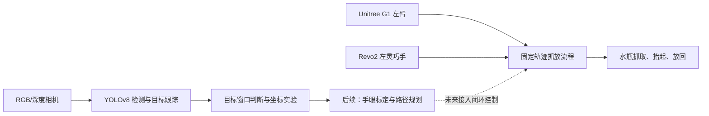

# 项目展示说明

本仓库展示一个基于宇树 G1 人形机器人、强脑 Revo2 灵巧手和 RGB/深度相机的视觉辅助抓取系统。当前项目以“识别水瓶、固定轨迹抓取、抬起展示、放回并收手”为主线，逐步向手眼标定、三维定位和自动化抓取扩展。

项目目前不是简单的文件备份，而是一个可继续迭代的机器人手眼协同工程样例：仓库中保留了机械臂控制脚本、灵巧手控制脚本、YOLOv8 水瓶检测、目标跟踪、深度相机与坐标转换实验代码，以及恢复和继续开发所需的说明文档。

## 项目目标

让 G1 左臂和 Revo2 左灵巧手配合完成桌面水瓶抓放任务，并逐步接入视觉定位和路径规划能力。

阶段目标分为三层：

1. 固定轨迹抓放：先让手臂和灵巧手稳定完成一次完整动作。
2. 视觉辅助判断：用 YOLOv8 和相机判断水瓶是否在可抓取窗口内。
3. 自动化闭环：完成手眼标定、深度定位和轨迹规划后，让视觉结果参与机械臂运动决策。

## 当前进展

已经完成并整理进仓库的内容：

| 模块 | 当前能力 |
| --- | --- |
| G1 左臂控制 | 固定轨迹预抓、抓瓶、抬小臂、外扩避让、下放、收回 |
| Revo2 左手控制 | 内置串口控制和抓瓶手型，不依赖外部手部测试脚本 |
| 安全流程 | 初始位检查、异常偏差停止、结束时平滑释放 `arm_sdk` |
| RGB 视觉检测 | YOLOv8 实时检测水瓶，输出目标框、中心点和置信度 |
| 目标跟踪 | 对已识别目标做平滑跟踪，降低检测框跳到其他物体的概率 |
| 深度与坐标实验 | 保留深度检测、目标点记录、抓取窗口判断和相机到机器人坐标转换脚本 |
| 项目恢复 | 提供恢复出厂设置后的代码、模型和 SDK 恢复步骤 |

当前主流程仍然以固定轨迹为主，视觉检测暂未直接闭环控制机械臂。这样做是为了先保证实体机器人动作安全，再逐步引入视觉反馈。

## 系统结构



## 典型演示流程

实体机器人演示时，当前推荐流程是：

1. 机器人站立并确认环境安全。
2. 打开 RGB 相机和 YOLO 水瓶检测窗口。
3. 将水瓶放在固定轨迹可抓取区域内。
4. 执行独立全流程脚本。
5. G1 左臂到达预抓固定点。
6. Revo2 左手执行预备手型并抓住水瓶。
7. 小臂抬起水瓶并悬停展示。
8. 大臂外扩避开身体和桌面区域。
9. 下放小臂，张手放回水瓶。
10. 空手收回并平滑释放控制权。

对应核心脚本：

```text
g1_hand_arm_project/arm_pick_place_standalone.py
g1_hand_arm_project/vision/start_bottle_rgb_fast.sh
g1_hand_arm_project/vision/detect_bottle_2d.py
```

## 仓库内容

| 路径 | 用途 |
| --- | --- |
| `g1_hand_arm_project/` | 当前抓瓶主项目，包含机械臂、灵巧手、视觉和测试脚本 |
| `g1_hand_arm_project/vision/` | YOLO 检测、目标跟踪、深度检测、记录点和坐标转换实验 |
| `hand_control/revo2/` | Revo2 左手定制控制脚本 |
| `models/` | 可公开上传的小模型和模型说明 |
| `docs/` | 项目展示、恢复说明、Codex 上下文和排除文件清单 |
| `legacy/` | 早期实验脚本，仅用于追溯，不作为当前主流程运行 |

没有上传到 GitHub 的内容包括完整厂商 SDK、大型训练数据集、过大的模型文件、本地运行配置和个人密钥。这些内容应按恢复文档从官方来源或本机备份补齐。

## 安全边界

实体机器人动作必须遵守以下边界：

- 手臂控制和手指控制分离，避免把机械臂动作写入单独手部测试脚本。
- 不使用空 `LowCmd` 直接释放 `arm_sdk`。
- 每次实体动作前先检查初始位和周围空间。
- 标定和路径规划稳定前，不让视觉检测结果直接控制机械臂。
- 新参数先空手、小幅、低速测试，再抓取真实物体。

## 后续方向

下一步重点不是继续堆备份文件，而是把系统从“固定轨迹演示”推进到“视觉辅助自动化”：

1. 完成 ChArUco 或 AprilTag 手眼标定。
2. 将 RGB 检测结果和深度相机对齐，得到水瓶三维位置。
3. 建立机器人 base 坐标下的目标点估计。
4. 用轨迹规划替代手工调参的固定轨迹。
5. 增加抓取成功/失败判断和异常回退流程。

## 适合展示的项目定位

这个仓库适合用来展示：

- 人形机器人手眼协同项目的工程实现过程；
- 从固定轨迹到视觉闭环的渐进式开发路线；
- 真实机器人调试中的安全流程、脚本隔离和参数验证方法；
- YOLO 检测、目标跟踪、灵巧手抓握和 G1 手臂控制的集成实践。

仓库当前仍处于实验迭代阶段，因此说明中保留了恢复、测试和安全约束。它既是展示项目，也是后续继续开发的工程基线。
